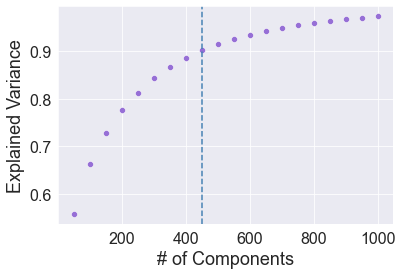

# Swarm Classification Model
These models are built using the Kaggle Swarm classification dataset. Some of the code, such as module imports, is hidden.


```python
# Module imports and seaborn styling
import os
import pandas as pd
import numpy as np
import matplotlib.pyplot as plt
import seaborn as sns
from sklearn.model_selection import train_test_split, GridSearchCV
from sklearn.preprocessing import StandardScaler
from sklearn.decomposition import PCA
from sklearn.pipeline import make_pipeline
import sklearn.metrics
from sklearn.svm import SVC
from sklearn.linear_model import LogisticRegression
from xgboost import XGBClassifier
import helpers
sns.set_style('darkgrid')
```


```python
df = pd.read_csv('swarm.csv')
```

## Data Description


```python
helpers.get_dataframe_info(df)
helpers.get_zero_var_cols(df)
```

    ================================================================================
    DATA DESCRIPTION:
    Data description: 23309 rows and 2401 columns
    Data types: [dtype('float64') dtype('int64')]
    Number of missing values: 0
    Number of duplicated rows: 4607
    ================================================================================
    No columns have 0 variation


```python
df.describe()
```


<div>
<style scoped>
    .dataframe tbody tr th:only-of-type {
        vertical-align: middle;
    }

    .dataframe tbody tr th {
        vertical-align: top;
    }

    .dataframe thead th {
        text-align: right;
    }
</style>
<table border="1" class="dataframe">
  <thead>
    <tr style="text-align: right;">
      <th></th>
      <th>x1</th>
      <th>y1</th>
      <th>xVel1</th>
      <th>yVel1</th>
      <th>xA1</th>
      <th>yA1</th>
      <th>xS1</th>
      <th>yS1</th>
      <th>xC1</th>
      <th>yC1</th>
      <th>...</th>
      <th>yVel200</th>
      <th>xA200</th>
      <th>yA200</th>
      <th>xS200</th>
      <th>yS200</th>
      <th>xC200</th>
      <th>yC200</th>
      <th>nAC200</th>
      <th>nS200</th>
      <th>Swarm_Behaviour</th>
    </tr>
  </thead>
  <tbody>
    <tr>
      <th>count</th>
      <td>23309.000000</td>
      <td>23309.000000</td>
      <td>23309.000000</td>
      <td>23309.000000</td>
      <td>23309.000000</td>
      <td>23309.000000</td>
      <td>23309.000000</td>
      <td>23309.000000</td>
      <td>23309.000000</td>
      <td>23309.000000</td>
      <td>...</td>
      <td>23309.000000</td>
      <td>23309.000000</td>
      <td>23309.000000</td>
      <td>23309.000000</td>
      <td>23309.000000</td>
      <td>23309.000000</td>
      <td>23309.000000</td>
      <td>23309.000000</td>
      <td>23309.000000</td>
      <td>23309.000000</td>
    </tr>
    <tr>
      <th>mean</th>
      <td>104.413631</td>
      <td>-73.481853</td>
      <td>-0.697607</td>
      <td>0.061480</td>
      <td>-0.147964</td>
      <td>0.152034</td>
      <td>-1.055732</td>
      <td>-0.731546</td>
      <td>-0.034915</td>
      <td>0.077123</td>
      <td>...</td>
      <td>0.086824</td>
      <td>-0.126276</td>
      <td>0.127497</td>
      <td>-1.526260</td>
      <td>-0.118891</td>
      <td>-0.012388</td>
      <td>0.085076</td>
      <td>26.433995</td>
      <td>2.130679</td>
      <td>0.341242</td>
    </tr>
    <tr>
      <th>std</th>
      <td>843.200079</td>
      <td>573.329374</td>
      <td>6.427840</td>
      <td>7.366739</td>
      <td>0.376078</td>
      <td>0.588582</td>
      <td>26.388570</td>
      <td>20.684183</td>
      <td>0.559690</td>
      <td>0.628478</td>
      <td>...</td>
      <td>7.683539</td>
      <td>0.378830</td>
      <td>0.570589</td>
      <td>73.903764</td>
      <td>7.002853</td>
      <td>0.555143</td>
      <td>0.614603</td>
      <td>34.136098</td>
      <td>7.431911</td>
      <td>0.474136</td>
    </tr>
    <tr>
      <th>min</th>
      <td>-1414.140000</td>
      <td>-1012.180000</td>
      <td>-18.590000</td>
      <td>-18.410000</td>
      <td>-1.000000</td>
      <td>-1.000000</td>
      <td>-944.070000</td>
      <td>-847.910000</td>
      <td>-2.680000</td>
      <td>-2.680000</td>
      <td>...</td>
      <td>-18.440000</td>
      <td>-1.040000</td>
      <td>-1.000000</td>
      <td>-4079.230000</td>
      <td>-370.240000</td>
      <td>-2.680000</td>
      <td>-2.680000</td>
      <td>0.000000</td>
      <td>0.000000</td>
      <td>0.000000</td>
    </tr>
    <tr>
      <th>25%</th>
      <td>-542.020000</td>
      <td>-611.220000</td>
      <td>-5.360000</td>
      <td>-5.680000</td>
      <td>-0.230000</td>
      <td>-0.010000</td>
      <td>0.000000</td>
      <td>0.000000</td>
      <td>-0.040000</td>
      <td>-0.020000</td>
      <td>...</td>
      <td>-5.600000</td>
      <td>-0.190000</td>
      <td>0.000000</td>
      <td>0.000000</td>
      <td>0.000000</td>
      <td>-0.070000</td>
      <td>0.000000</td>
      <td>2.000000</td>
      <td>0.000000</td>
      <td>0.000000</td>
    </tr>
    <tr>
      <th>50%</th>
      <td>145.300000</td>
      <td>-157.350000</td>
      <td>-0.450000</td>
      <td>-1.540000</td>
      <td>0.000000</td>
      <td>0.000000</td>
      <td>0.000000</td>
      <td>0.000000</td>
      <td>0.000000</td>
      <td>0.000000</td>
      <td>...</td>
      <td>-0.780000</td>
      <td>0.000000</td>
      <td>0.000000</td>
      <td>0.000000</td>
      <td>0.000000</td>
      <td>0.000000</td>
      <td>0.000000</td>
      <td>12.000000</td>
      <td>0.000000</td>
      <td>0.000000</td>
    </tr>
    <tr>
      <th>75%</th>
      <td>896.200000</td>
      <td>425.700000</td>
      <td>3.940000</td>
      <td>7.260000</td>
      <td>0.000000</td>
      <td>0.940000</td>
      <td>0.000000</td>
      <td>0.000000</td>
      <td>0.000000</td>
      <td>0.020000</td>
      <td>...</td>
      <td>7.480000</td>
      <td>0.000000</td>
      <td>0.540000</td>
      <td>0.000000</td>
      <td>0.000000</td>
      <td>0.000000</td>
      <td>0.030000</td>
      <td>35.000000</td>
      <td>1.000000</td>
      <td>1.000000</td>
    </tr>
    <tr>
      <th>max</th>
      <td>1406.080000</td>
      <td>1015.800000</td>
      <td>18.470000</td>
      <td>18.570000</td>
      <td>1.000000</td>
      <td>1.040000</td>
      <td>68.560000</td>
      <td>234.740000</td>
      <td>2.680000</td>
      <td>2.680000</td>
      <td>...</td>
      <td>18.490000</td>
      <td>1.000000</td>
      <td>1.040000</td>
      <td>255.990000</td>
      <td>57.840000</td>
      <td>2.680000</td>
      <td>2.680000</td>
      <td>142.000000</td>
      <td>64.000000</td>
      <td>1.000000</td>
    </tr>
  </tbody>
</table>
<p>8 rows × 2401 columns</p>
</div>


```python
# Drop duplicate columns
df = df.drop_duplicates(keep = 'first')
```

## Splitting into training/testing sets


```python
X = df.drop(['Swarm_Behaviour'], axis = 1)
y = df['Swarm_Behaviour']

X_train, X_test, y_train, y_test = train_test_split(X, y, test_size=0.2, random_state=42)
```

## Principal Components Analysis


```python
sc = StandardScaler()
X_scaled = sc.fit_transform(X_train)

pca_comps = np.arange(50, 1050, 50)
pca_variance = []
for n in pca_comps:
    pca = PCA(n_components = n,
              random_state=42)
    pca.fit(X_scaled)
    pca_variance.append(pca.explained_variance_ratio_.sum())
```


```python
# Plotting the results
ax = sns.scatterplot(x=pca_comps,
                y=pca_variance,
                color="#966FD6")
ax.set_xlabel("# of Components",
              fontsize=18)
ax.set_ylabel("Explained Variance",
              size=18)
ax.tick_params(labelsize=16)
ax.axvline(x=450,
           color="steelblue",
           linestyle="dashed")
```


    <matplotlib.lines.Line2D at 0x7fa1b0cd0520>


    

    


450 components reduces the dimensionality of the data quite a bit and still explaines most of the variance. From previous testing, it does a bit better than 100 or 200 components.

## Support Vector Classification


```python
pipeln = make_pipeline(StandardScaler(), 
                       PCA(n_components=450,
                           random_state=42), 
                       SVC(C = 0.01, gamma = 0.01, kernel = "linear"))

pipeln.fit(X_train, y_train)


predicted = pipeln.predict(X_test)
```

### Training set metrics


```python
helpers.get_model_metrics(y_train, pipeln.predict(X_train))
```

    Accuracy: 90.29%
    F1 score:  0.8584
    Precision:  0.8799
    Recall:  0.8379


### Test set metrics


```python
helpers.get_model_metrics(y_test, predicted)
```

    Accuracy: 87.44%
    F1 score:  0.8127
    Precision:  0.8354
    Recall:  0.7913


## In progress...


```python

```
